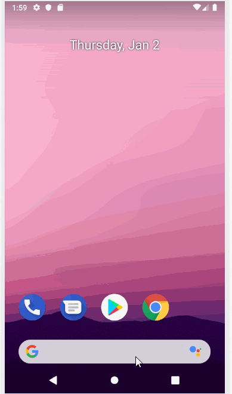

# Project 1 - *Simple Todo*

**Simple Todo** is an android app that allows building a todo list and basic todo items management functionality including adding new items, editing and deleting an existing item.

Submitted by: **Ayesha Parvez**

Time spent: **6** hours spent in total

## User Stories

The following **required** functionality is completed:

* [x] User can **view a list of todo items**
* [x] User can **successfully add and remove items** from the todo list
* [x] User's **list of items persisted** upon modification and and retrieved properly on app restart

The following **optional** features are implemented:

* [x] User can **tap a todo item in the list and bring up an edit screen for the todo item** and then have any changes to the text reflected in the todo list

The following **additional** features are implemented:

* [ ] List anything else that you can get done to improve the app functionality!

## Video Walkthrough

Here's a walkthrough of implemented user stories:

GIF created with [LiceCap](http://www.cockos.com/licecap/).

## Notes

Creating this app was one of the most enjoyable coding projects that I have worked on. However, since I have no prior experience of creating an android app, I did run into a few obstacles while working on this project.
It took me a while to get used to the environment and understand what the code means. In fact, I had to rewatch certain sections of the videos to comprehend why the code has been written in a specific way. I also ran into multiple errors, because of which I had to spend a good amount of time debugging my code. 
On the whole though, creating the Simple Todo App was a good learning experience and a fun introduction to Android Studio

## License

    Copyright 2020 Ayesha Parvez

    Licensed under the Apache License, Version 2.0 (the "License");
    you may not use this file except in compliance with the License.
    You may obtain a copy of the License at

        http://www.apache.org/licenses/LICENSE-2.0

    Unless required by applicable law or agreed to in writing, software
    distributed under the License is distributed on an "AS IS" BASIS,
    WITHOUT WARRANTIES OR CONDITIONS OF ANY KIND, either express or implied.
    See the License for the specific language governing permissions and
    limitations under the License.
